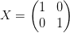
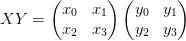
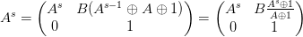

# 解决oneTimePad2-366的问题

> 这里的解法在[solve.sage](./solve.sage)
> 参考了[https://gist.github.com/elliptic-shiho/66265882a608cf77bf34067c25ed2594](https://gist.github.com/elliptic-shiho/66265882a608cf77bf34067c25ed2594)
> [https://grocid.net/2017/03/20/0ctf17-all-crypto-tasks/](https://grocid.net/2017/03/20/0ctf17-all-crypto-tasks/)

```python
from sage.all import *

def ntopoly(npoly):
    return sum(c*X**e for e, c in enumerate(Integer(npoly).bits()))

def polyton(poly):
    if not hasattr(poly, 'list'):
      poly = poly.polynomial()
    a = poly.list()
    return sum(int(a[i])*(1 << i) for i in xrange(len(a)))

N = 128
# poly = 2^128 + 0x87
x = var('x')
poly = x^128 + x^7 + x^2 + x + 1

F = GF(2^N, 'z128', modulus=poly)
X = F.gen()

A = ntopoly(0xc6a5777f4dc639d7d1a50d6521e79bfd)
B = ntopoly(0x2e18716441db24baf79ff92393735345)
print A

ciphertext = [
    0x0da8e9e84a99d24d0f788c716ef9e99c,
    0xc447c3cf12c716206dee92b9ce591dc0,
    0x722d42462918621120ece68ac64e493a,
    0x41ea3a70dd7fe2b1d116ac48f08dbf2b,
    0x26bd63834fa5b4cb75e3c60d49676092,
    0x1b91df5e5e631e8e9e50c9d80350249c
]
ciphertext = map(ntopoly, ciphertext)

plaintext = ['One-Time Pad is ', 'used here. You w', "on't know that t", 'he flag is flag{', None, '}.']

plaintext = map(lambda x: ntopoly(ZZ(x.encode('hex'), 16)) if x is not None else None, plaintext)

keys = []
keys += [plaintext[0] + ciphertext[0]]
keys += [plaintext[1] + ciphertext[1]]
keys += [plaintext[2] + ciphertext[2]]
keys += [plaintext[3] + ciphertext[3]]

t = B / (A-1)

K1 = keys[0]
K2 = (keys[1] + t) / (keys[0] + t)
K3 = (keys[2] + t) / (keys[1] + t)
K4 = (keys[3] + t) / (keys[2] + t)
print K2

N = ntopoly(76716889654539547639031458229653027958)

assert K2 == A^polyton(N)
assert K3 == A^polyton(N^2) 
assert K4 == A^polyton(N^4)

K5 = A^polyton(N^8)

print hex(polyton(ciphertext[4] + (K5 * (keys[3] + t) + t))).decode('hex')

```

> 运行solve.sage 请先安装 [sage](http://www.sagemath.org/download.html)
> 运行命令是 sage solve.sage 就可以得到了

## 解题思路
> 这里原来的方法是 与 
> 变成的
> 
> 反向得到当前的逆方法就是了。